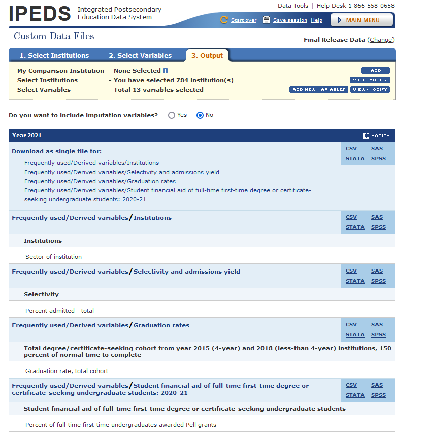

*Note*:

This instruction is for people who wish to download annual data from IPEDS and manipulate it in R or RStudio.

### Steps

1.  To download IPEDS, we first need to open the [IPEDS](https://nces.ed.gov/ipeds/use-the-data) website.

2.  IPEDS website provides multiple options for us to explore. To download data we need, we need to go to "**Survey Data**" and choose "**Custom data files**".

3.  To customize the data files, choose groups of institutions.

You can make your choice based on your needs. I will take public, four-year institutions as an example, click "**By Groups**", then choose "**Sector**" -\> "Public, 4-year or above". Then, click "Search" -\> "**CONTINUE**" to step 2.

4.  Choose years and variables we want.

I will choose 2018- 2021 with variables: "percent admitted -total", "Percent of full-time first-time undergraduates awarded Pell grants", and "Graduation rate, total cohort".

🌻 Congratulations! Now you can download your data files!

5.  Download the data files.

To have the data files that are easy to manipulate and import to R, choose "**csv**".

If you can download files as a whole, you might want do that instead of download a single file.

With those data files, we need to extract them before importing them into R.

### 👉 Tips

1.  Make sure that you check and understand the variables' [definitions](https://surveys.nces.ed.gov/ipeds/public/glossary) before you use them.
2.  Make sure that you explore all relevant variables that you want. Some variables have similar names but different definitions.
3.  Make sure that you download data files year by year since variables' definition might change.
4.  Explore Frequently used/ Derived variables first. It include variables that might not be in the general classification. Sometimes, it saves your time.
